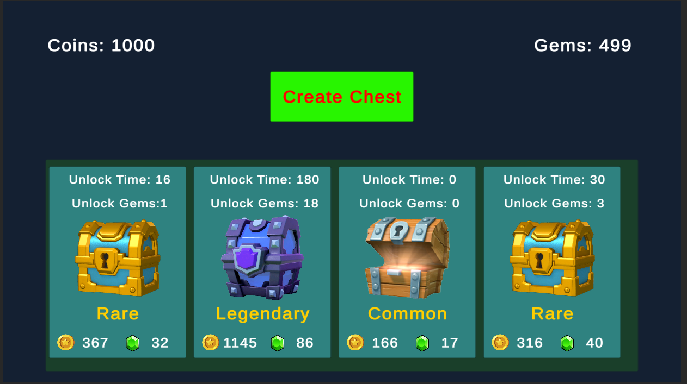
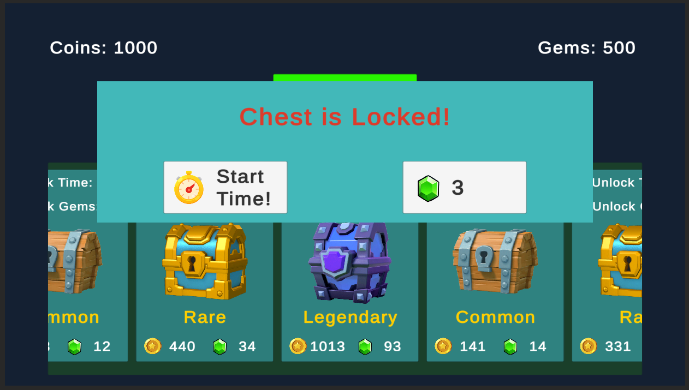
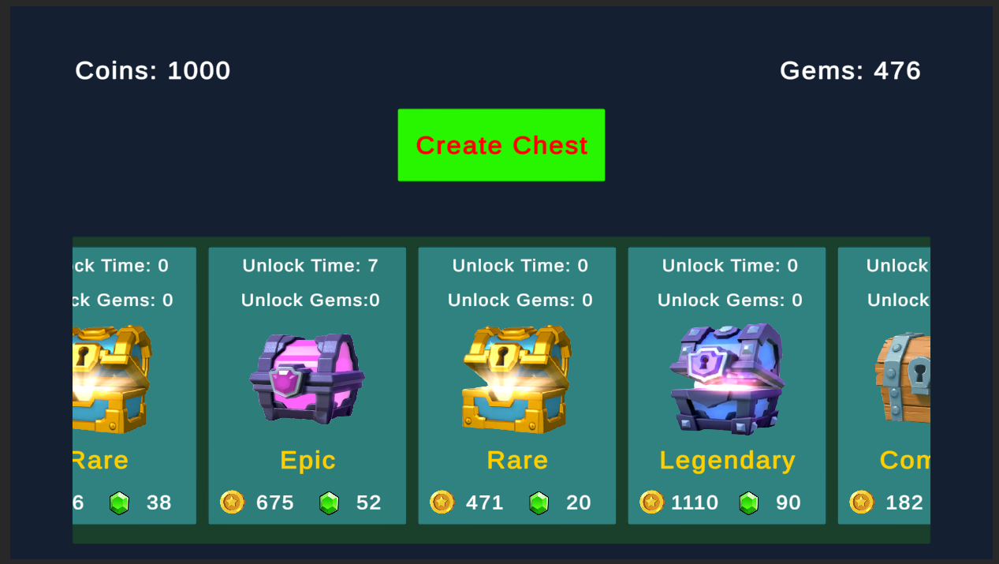
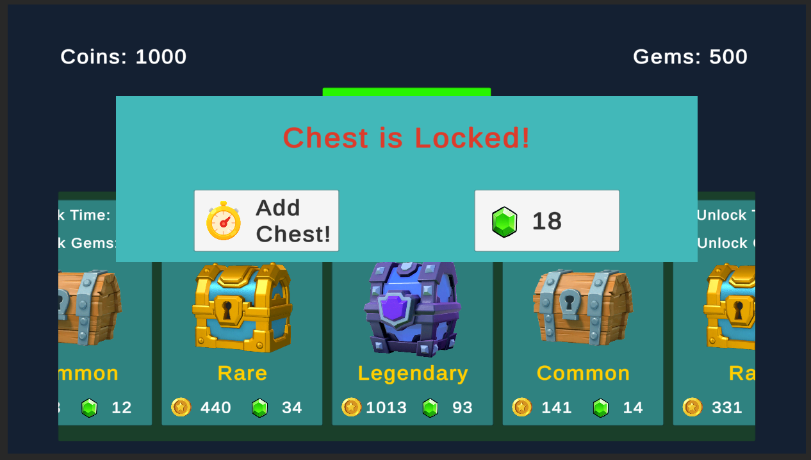

# Clash Royale Chest System
Chest system similar to the clash royale game.

## Implementation and Design Patterns Used
- Used MVC pattern for making the chest system.
- Fully customizable code architecture.
- Used scriptable objects for storing chests data.
- Used LayoutGroup for the proper alignment of chest slots.
- We can add more chest easily.

